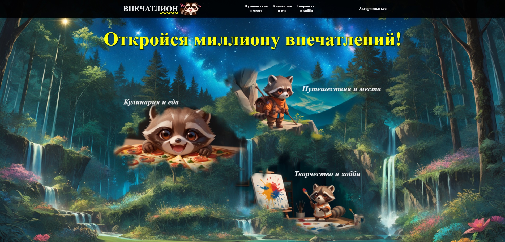

# Практический проект для моей дипломной работы на тему "Разработка социальной сети «Впечатлион» с применением фреймворка React и визуальных решений, сгенерированных в нейросети Stable Diffusion"



## Инструкция

1. Склонировать себе этот репозиторий, выполнить команду ниже для установки
   необходимых node_modules

```
npm i
```

2. Запустить сервер разработки, выполнив в терминале команду

```
npm run dev
```

3. Перейти на сайт, кликнув по появившейся в окне терминала ссылке левой кнопкой
   мыши с зажатой клавишей Ctrl или скопировать следующую ссылку в адресную
   строку в браузере и самостоятельно выполнить переход.

```
http://localhost:5173/
```

## Логины и пароли пользователей для тестирования сайта

Сайт можно исследовать в режиме гостя или в качестве авторизованного
пользователя. Для испытания в качестве авторизованного гостя необходимо
выполнить авторизацию по одной из следующих пар логинов и паролей.

```
username: Sladko3zhka
password: HochuBlin4ik

username: BespechnyEzdok
password: Il0veRacc00n

username: Krasav4ik
password: Pr0stoKrasav4ik

username: BuLLIeHKa
password: CherryP1ck

username: MrExtreme
password: JustD0It

username: ASTROcat
password: Me0wMe0w
```

## Основные страницы и разделы, их предназначение

Среди основных страниц можно выделить **Main Page**, **Travel Page**, **Culinary
Page**, **Creativity Page**, **Login Page**, **My Profile Page** (последняя
доступна авторизованному пользователю при клике на собственный аватар в
header'e).

**Main Page** знакомит гостя с представленными категориями, рассказывает о
концепции данного онлайн-сообщества и приводит некоторую статистику о самых
активных пользователях и наиболее популярных постах.

**Travel Page**, **Culinary Page** и **Creativity Page** - страницы,
представляющие собой тематические разделы с лентой новостей по данным тематикам.

Лента новостей представляет собой структуру из фильтруемых по категории и
сортируемых по выбранному вами порядку публикаций. В ленте представлены лишь
превью публикаций: заголовок, изображение (отображается первое, если в
публикации их несколько), краткое описание, кликабельные значки лайков и
комментариев с числовыми показателями, отображающими количество и того, и
другого. В случае, если пост написали вы (пользователь, под данными которого вы
зашли), на карточке поста также присутствует иконка корзины, позволяющая удалить
вашу публикацию.

По клику на карточку поста открывается модальное окно с полным содержанием
публикации, где отображаются заголовок, автор, изображение (или изображения,
если их несколько), полная версия описания, кликабельная иконка лайка и
индикатор количества лайков, полностью функциональная форма оставления отзыва
(для авторизованных пользователей). Каждый отзыв состоит из аватара
пользователя, имени пользователя и текстового сообщения. В случае, если отзыв
оставили вы, также присутствует иконка корзины, позволяющая удалить собственный
комментарий.

По каждому пользователю можно получить информацию. Для этого достаточно кликнуть
на аватар пользователя в комментариях или на аватар автора поста, после чего
откроется еще одно модальное окно. В модальном окне (аналогично по структуре
странице **My Profile Page**) содержатся: крупный аватар пользователя, его или
ее никнейм, его или ее информация о себе, статистика по количеству публикаций и
отзывов на сайте, список с заголовками всех публикаций этого автора, список с
текстовым содержанием каждого комментария этого пользователя и указанием поста,
под которым он был оставлен.

Каждое модальное окно закрывается нажатием на интуитивно понятный красный
крестик в правом верхнем углу.

## Список использованных технологий, языков, фреймворков и инструментов
HTML/CSS, SASS (SCSS), JavaScript, React, Node.js, Vite, Visual Studio Code

Adobe Photoshop, Stable Diffusion - для самостоятельной разработки визуальной составляющей сайта при отсутствии заранее подготовленного дизайна и имеющейся творческой свободе в реализации авторского замысла

Библиотеки react-redux, @reduxjs/toolkit, react-router-dom, uuid